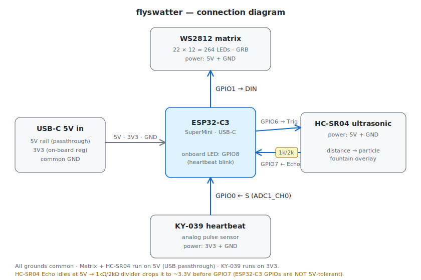

# flyswatter

An ESP32-C3 LED-matrix toy: an animated WS2812 panel plus two sensors, in a single
ESP-IDF firmware. The matrix is the part that gets played with; the sensors hang off
the side and feed it.

What's running right now:
- a 22×12 panel showing a red disco stick-figure dancing to a 4/4 beat,
- a **KY-039** finger pulse sensor blinking the onboard LED on each heartbeat,
- an **HC-SR04** ultrasonic rangefinder spawning a blue particle fountain that
  intensifies as your hand gets closer.

Everything lives in one file: **`main/flyswatter.c`**.

## Hardware

ESP32-C3 SuperMini (single-core RISC-V, USB-C). Pin map as currently wired:

| Function | Pin | Notes |
|---|---|---|
| WS2812 matrix data (DIN) | GPIO1 | 22×12 = 264 LEDs, GRB, driven via RMT (no DMA on the C3) |
| KY-039 pulse sensor (S) | GPIO0 / ADC1_CH0 | analog; `+`→3V3, `-`→GND, 12 dB atten |
| Onboard LED | GPIO8 | **active-low** (drive LOW to light); heartbeat indicator, no external wiring |
| HC-SR04 Trig | GPIO6 | direct; 3.3 V output triggers the sensor fine |
| HC-SR04 Echo | GPIO7 | **through a 1 kΩ/2 kΩ divider** — see below |

Power: the matrix and the HC-SR04 run from **5 V** (USB passthrough); the KY-039 runs
from **3V3**. All grounds are common. See **[wiring.svg](wiring.svg)** for the full
connection diagram.



> **Echo divider (don't skip).** The HC-SR04 Echo line idles/drives at 5 V, and the C3's
> GPIOs are 3.3 V and **not 5 V-tolerant**. Echo goes through a divider (Echo → 1 kΩ →
> GPIO7, and GPIO7 → 2 kΩ → GND) so the pin only ever sees ~3.3 V. Wiring Echo straight
> to a GPIO can damage the board.

> **Power budget.** 264 WS2812s at full white is ~15 A — far beyond USB. The firmware
> keeps current sane with a hard brightness gate (`MATRIX_BRIGHTNESS = 20`, `OUT_CAP = 56`).
> If you raise those, power the panel from an external 5 V supply, not the board.

## Build, flash, monitor

ESP-IDF **v6.0.1**. `idf.py` is not on PATH by default — source the export script first.
(Full environment detail, including first-time setup, is in `CLAUDE.md`.)

```bash
. /Users/personal/.espressif/v6.0.1/esp-idf/export.sh

idf.py -B build_verify build                                   # build
idf.py -B build_verify -p /dev/cu.usbmodem1101 flash monitor  # flash + monitor (Ctrl-] to exit)
```

> Build into **`build_verify/`**, not `build/`. `build/` belongs to CLion; driving it from
> the command line desyncs CMake and produces confusing link errors. `build_verify/` is
> gitignored and safe.

The board enumerates as a USB-serial-JTAG device — find the port with `ls /dev/cu.usbmodem*`.

## How it works (runtime architecture)

Three things run concurrently on the single core:

| Activity | Runs in | Priority | Job |
|---|---|---|---|
| `matrix_task` | FreeRTOS task | 5 | renders the animation at ~30 fps via `led_strip`/RMT; composites the sonar-driven particle overlay |
| `sonar_task` | FreeRTOS task | 5 | pings the HC-SR04 at 10 Hz, publishes the latest distance |
| heartbeat detector | `app_main` loop | (main task) | samples the KY-039 at 50 Hz, blinks the onboard LED per beat |

**Shared state** is a single value: `g_distance_cm` (a `volatile float`, written by
`sonar_task`, read by `matrix_task`; `< 0` means "no target / out of range"). One writer,
one reader, 32-bit aligned — no mutex needed on this MCU.

**The sonar is deliberately non-blocking.** The naive HC-SR04 driver busy-waits on Echo,
which on a single core would stall the 30 fps matrix and the 50 Hz heartbeat, and would
also corrupt the pulse measurement whenever another task preempts mid-wait. Instead, a
GPIO edge ISR (`echo_isr`) timestamps the echo edges in interrupt context, and `sonar_task`
*blocks* on a task notification rather than spinning. If you touch the sonar, preserve this
structure — don't reintroduce a polling/`pulseIn`-style loop.

## Configuration

Behaviour is steered by `#define`s at the top of `main/flyswatter.c`:

- `ENABLE_MATRIX`, `ENABLE_SONAR` — switch whole subsystems off (handy for bench-testing one thing).
- `SONAR_DRIVES_VISUALS` — `1` overlays the distance-reactive particle fountain; `0` leaves the animation pure.
- `MATRIX_BRIGHTNESS`, `OUT_CAP` — the power gate. Author colors at full 0–255 intensity and let these scale them; don't hand-dim.
- `MATRIX_SERPENTINE` — panel wiring (`0` progressive / `1` boustrophedon). Always write pixels through `xy_to_index()` so this is respected.
- `HB_*` — heartbeat detector tuning (sensitivity, refractory, invert).
- `SONAR_NEAR_CM`, `SONAR_FAR_CM` — the distance window mapped to the effect.
- `HB_PLOT`, `SONAR_PLOT` — stream samples for the Arduino-style serial plotter. **They share stdout — enable only one at a time** or the plot is unreadable.

## Bring-up & tuning

- **Heartbeat:** set `HB_PLOT 1`, watch `raw,acf,thr` on the serial plotter, rest a fingertip on the sensor with steady pressure, and tune `HB_MIN_AMPLITUDE` to sit above the noise. Flip `HB_INVERT` if beats point downward on your module.
- **Sonar:** set `SONAR_PLOT 1` (and `HB_PLOT 0`), confirm the streamed distance tracks a hand moving toward/away; out-of-range reads `-1`.
- **Smoothness is the integration test:** with all three active, the animation should run with no periodic hitch. A stutter synced to the 10 Hz ping means something in the sonar path started blocking.

## Code layout

One file, `main/flyswatter.c`, in banner-commented sections: matrix config → matrix
helpers → dancer (pose/skeleton/draw) → choreography → heartbeat → HC-SR04 → `app_main`.

The reusable matrix helpers are meant to survive animation swaps — keep them:
`xy_to_index`, `clampf`, `lerpf`, `put_px` (the brightness gate), and `g_fb` + `fb_add`
(the linear-light framebuffer you composite layers into before flushing).

## Troubleshooting

- **Distance always `-1`:** check the divider and 5 V on the HC-SR04, and that Trig/Echo are on GPIO6/7.
- **Board resets / brownouts:** too many LEDs too bright on USB — lower `MATRIX_BRIGHTNESS` or add an external 5 V supply.
- **Serial plot is garbled:** both `HB_PLOT` and `SONAR_PLOT` are on; enable one.
- **Build fails with ldgen/`objdump` or mbedtls link errors:** something ran in `build/` (CLion's dir). Build in `build_verify/`, and don't run raw `ninja` in `build/`.